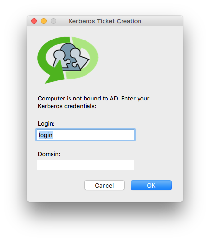
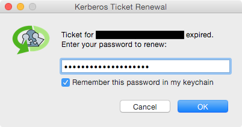
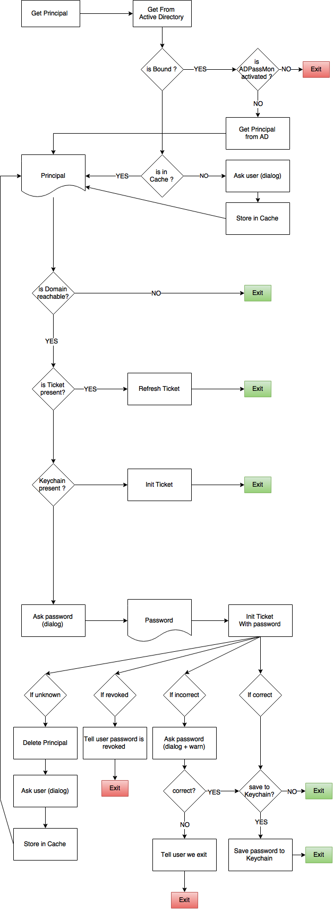

[](https://travis-ci.org/ftiff/KerbMinder2)

# KerbMinder


**KerbMinder** is a tool for Mac OS X that keeps a logged-in user's Kerberos ticket current by attempting to renew or refresh it automatically any time the network state changes. It only presents a UI if it needs the user to supply a login or a password. It is designed for users who :
- has network-authenticated mobile accounts and often work off of corporate networks via VPN;
- or needs to leverage Kerberos SSO without having to bind the machine to a directory.
KerbMinder2_login.png



The password can be saved to the keychain so all subsequent renewals can use it. Should the saved password get out of sync with the domain — e.g. after the user changes their password — the keychain will automatically remove the old saved password and the user will be prompted to enter one.

## Why the '2' in KerbMinder2 ?
This is a fork and a rewrite of @pmbuko [KerbMinder](http://github.com/pmbuko/KerbMinder). My intent is to make it backward compatible and do a Pull Request. 
Originally, KerbMinder needed the computer to be bound. I personally think this is a thing from the past, so I added the possibility to specify a principal. After hours of struggling with the code to make, I figured out it would be much faster to do a complete rewrite. I don't intend to correct the bugs or enhance @pmbuko's version. 


### Acknowledgements

Portions of KerbMinder were inspired by code written by these fine humans (links point to the inspiring code, where possible):

* @pmbuko - original author of KerbMinder
* @ftiff - author of KerbMinder2
* [Joe Chilcote](https://github.com/chilcote)
* [Graham Gilbert](http://grahamgilbert.com/blog/2013/07/12/using-crankd-to-react-to-network-events/)
* [Gary Larizza](https://github.com/glarizza/scripts/blob/master/python/RefactoredCrankTools.py)
* [Per Olofsson](https://github.com/MagerValp/Scripted-Mac-Package-Creation/blob/master/scripts/postinstall)

I'd also like to thank

* [Allister Banks](https://twitter.com/Sacrilicious/status/543451138239258624) for pointing out an effective dig command to test for domain reachability.
* [Tim Sutton](http://twitter.com/tvsutton/status/544099669270605824) for telling me about Pashua.

## Requirements

* Mac OS X 10.8.5 or newer (compatible with 10.11.x)
* Python 2.7 (part of OS)
* crankd (PyMacAdmin, included)
* Pashua (included)

## How It Works

KerbMinder logs its activity to the system log. You can open up Console.app and filter for “KerbMinder” to see what it’s up to. You may want to make a network change (e.g. toggle off/on your wi-fi interface) to force it to act.

KerbMinder has a few components that operate in tandem.

### crankd.py

Part of the [PyMacAdmin](https://github.com/acdha/pymacadmin) project, crankd is an always-on LaunchDaemon configured to look for network changes. Specifically, it monitors the System Configuration framework's ```State:/Network/Global/IPv4``` subkey, which blips any time an ethernet interface gains or loses an IPv4 address. When a change is detected, it calls the following script.

### CrankTools.py

This script's main purpose is to determine if any ethernet interface (e.g. en0, en1, etc.) has an ip address. When called, it first sleeps for 30 seconds, allowing sufficient time for a wi-fi or VPN connection to be established. Then (with the help of ```networksetup -listnetworkserviceorder```) it gets a list of ethernet interfaces in service priority order and goes down that list looking for the first one with an ip address.

If an interface with an IP address is found, it touches a trigger file (```/Library/Application Support/crankd/kmfiles/trigger```) that the following LaunchAgent watches. This handoff in duties is necessary because this script runs as a LaunchDaemons in the root context, but Kerberos ticket renewals must be done in the user's context.

### KerbMinder2.py

This script runs as a triggered User LaunchAgent. 



### Pashua.py and Pashua.app

[Pashua](http://www.bluem.net/en/mac/pashua/) is a tool for creating native Aqua dialog windows. KerbMinder uses it to display a password prompt window with a checkbox to optionally save the password.

## Installation

Download the package and run it. No reboot or logout is necessary, but admin privileges are required.

The KerbMinder.pkgproj bundle in this repo is an installer builder project for the free [Packages](http://s.sudre.free.fr/Software/Packages/about.html) app. If you'd like to build your own .pkg installer, just download the app, double-click on the project file, and then build and run the installer.

If you want to install manually, check the [Wiki](https://github.com/ftiff/KerbMinder2/wiki/Manual-Installation)

## ADPassMon Integration

The latest release of my [ADPassMon](http://yourmacguy.wordpress.com/ADPassMon) software lets users enable/disable KerbMinder via a menu item.

## What's next ?
I want to rewrite this tool again, to use Apple's Frameworks instead of CLI tools.

